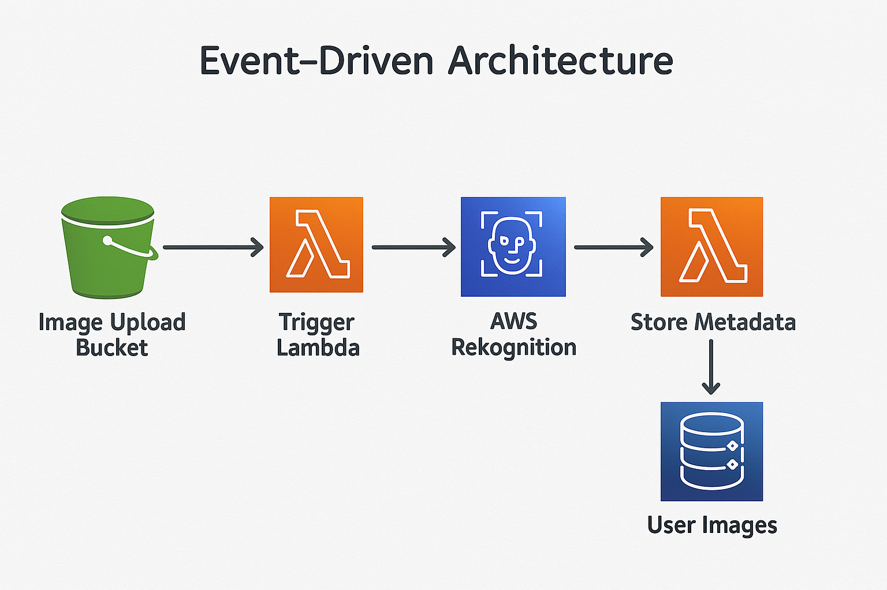

# 🎯 Event-Driven Facial Analysis with AWS Rekognition

This project is a serverless application that automatically analyzes user-submitted selfies/images using Amazon Rekognition. Results are saved to DynamoDB for further use.

---

## 📸 How It Works

1. User uploads an image to an S3 bucket (`image-rekognition-3434234234`)
2. S3 triggers a Lambda function
3. Lambda uses **Amazon Rekognition** to detect:
   - Emotions
   - Age range
   - Gender
   - Facial features
4. Result is stored in a **DynamoDB** table (`user-images`)

---

## 🧰 Services Used

| Service      | Purpose                          |
|--------------|----------------------------------|
| S3           | Stores uploaded images           |
| Lambda       | Event-driven processing function |
| Rekognition  | Detects facial attributes        |
| DynamoDB     | Stores analysis results          |
| IAM          | Secure permission management     |

---

## 🧠 Architecture

---

💡 Use Cases
- Identity verification
- Emotion-based surveys
- Face analytics for marketing
- Training datasets for ML models

🙌 Author
Abdul Raheem
DevOps Engineer
